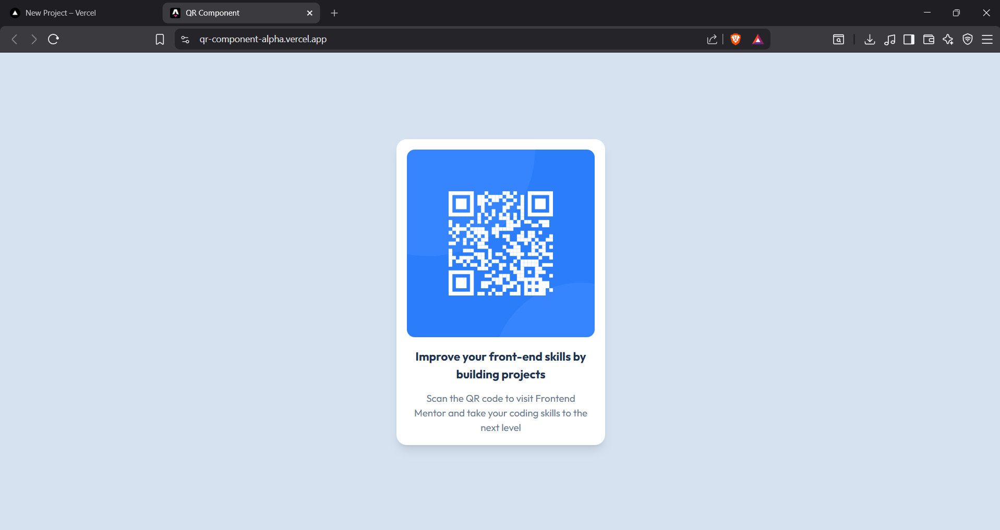

# 🧩 Proyecto: Componente QR Code

Este proyecto consiste en el desarrollo de un **componente de Código QR** utilizando **Astro** y **Tailwind CSS**.  
El objetivo es aplicar los conocimientos sobre **componentes**, **maquetación**, **estilos responsivos** y **utilidades CSS** para construir un diseño limpio, moderno y adaptable a diferentes dispositivos.

---

## 📖 Descripción general

### 🧩 Vista previa del proyecto



---

### 🔗 Enlaces del proyecto

- **Repositorio en GitHub:** [Agrega aquí la URL de tu repositorio](https://github.com/atarisama/qr-component)
- **Sitio desplegado (opcional):** [Agrega aquí la URL del proyecto desplegado, si usaste Vercel o Netlify](https://qr-component-alpha.vercel.app/)

---

## 🧠 Proceso de desarrollo

### 🛠️ Tecnologías utilizadas
Lista las herramientas y tecnologías utilizadas en el proyecto:

- [Astro](https://astro.build)
- [Tailwind CSS](https://tailwindcss.com/)
- HTML5 semántico
- Diseño responsivo (Mobile-first)
- Componentes reutilizables

---

### 💡 Lo que aprendí
Gracias a este proyecto pude mejorar el uso de los componentes de Astro, supe como organizar el código de una manera modular usando los archivos .astro. Además mejore el uso de Tailwind CSS aplicando estilos de una manera mas eficaz y rápida.

Ejemplo:
```html
<div class="bg-white rounded-2xl shadow-lg p-4 max-w-[320px] text-center">
  
  <h1 class="text-[hsl(218,44%,22%)] font-bold text-[18px] mb-3">
    Improve your front-end skills by building projects
  </h1>
</div>
```

---

### 🚀 Áreas de mejora

- Mejorar el manejo del responsive en pantallas pequeñas.  
- Implementar animaciones o transiciones suaves.  
- Explorar el uso de variables de Tailwind personalizadas.  
- Optimizar la estructura del proyecto y el uso de componentes.
- Profundizar el uso avanzado de Tailwind  

---

### 📚 Recursos útiles

- [Documentación de Astro](https://docs.astro.build)  
- [Guía oficial de Tailwind CSS](https://tailwindcss.com/docs)  
- [MDN Web Docs - HTML y CSS](https://developer.mozilla.org/es/)  
- [Guía de diseño responsivo](https://web.dev/responsive-web-design-basics/)  

---

### 👩‍💻 Autor

- **Nombre completo: Jesús Elí Sánchez Ruvalcaba**  
- **Carrera: TICs**  
- **Grupo: TC1**  
- **Correo institucional: 23151326@aguascalientes.tecnm.mx**  

---

### ✨ Reflexión final

Durante este proyecto lo mas sencillo que hice fue la estructura base y la creacion del proyecto, por otro lado lo mas desafiante fue lograr que el diseño fuera parecido al ejemplo original.

Trabajar con Tailwind me pareció genial, ya que permite dar diseños de una manera muy rápida sin necesidad de escribir CSS tradicional.

Uno de los mayores aprendizajes para mi fue el manejo correcto de las rutas para imágenes en astro, ya que es algo complejo de entender.

En futuros proyectos me gustaría aplicar estos conocimientos para crear cosas aun mas complejas, con mayor organización y mejores diseños.
